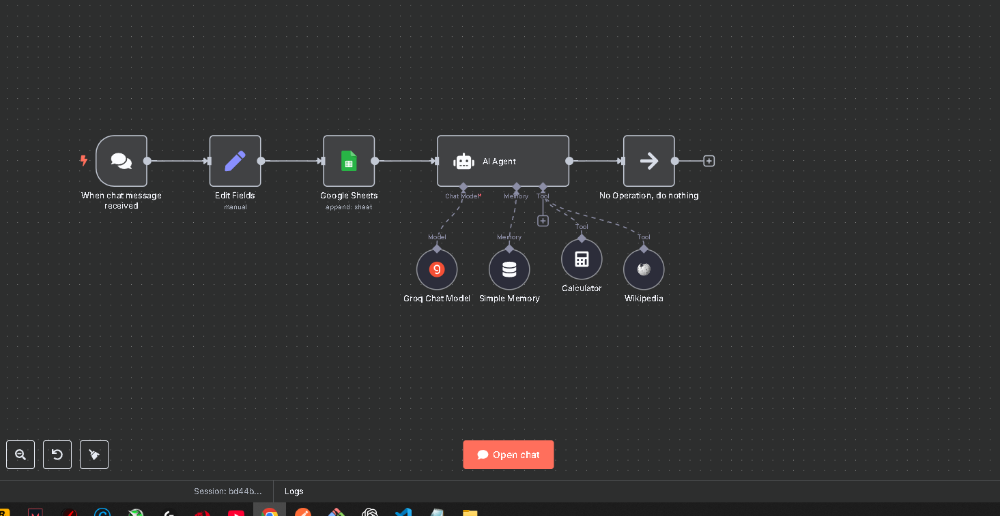
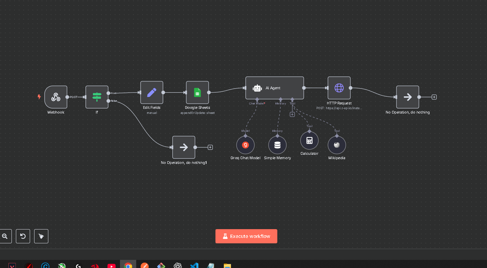

# 🤖 Projetos com n8n: Assistente IA com e sem WhatsApp

Este repositório contém dois projetos desenvolvidos com a plataforma de automação **n8n**, focados na criação de assistentes virtuais com inteligência artificial. Os projetos incluem funcionalidades como memória contextual, integração com APIs e automação de atendimento via WhatsApp.

---

## 📌 Projeto 1 — Assistente IA (n8n + LangChain + Google Sheets)

Um assistente de suporte inteligente, que responde mensagens com base em IA e armazena o histórico em uma planilha do Google Sheets.

### 🔧 Funcionalidades

- Gatilho de chat para receber mensagens
- Armazenamento da sessão e da mensagem no Google Sheets
- Processamento com modelo de linguagem via **Groq + LangChain**
- Memória de conversa com `memoryBufferWindow`
- Respostas personalizadas com emojis e tom informal
- Ferramentas adicionais: **Wikipedia**, **Calculadora**

### 📸 Fluxo do Projeto 1

[Clique aqui para testar 😄](https://leonardodev1.app.n8n.cloud/webhook/e92f673e-153c-40a3-bd1c-05cbf13be22e/chat)

## 💬 Projeto 2 — Assistente IA + WhatsApp (n8n + WhatsApp API)

Extensão do primeiro projeto, agora com integração direta com o WhatsApp. O assistente de IA é ativado por mensagens recebidas via API e responde automaticamente com base em contexto, linguagem natural e histórico de conversa.

### 🔧 Funcionalidades

- 🔔 **Webhook de entrada**: recebe mensagens enviadas por usuários via WhatsApp
- ✅ **Filtro inteligente**: ignora mensagens de grupos, newsletters, disparos automáticos
- 🧾 **Extração de dados**: captura nome do remetente, número de telefone e mensagem
- 📊 **Registro de contatos**: dados salvos em uma planilha do Google Sheets
- 🤖 **Processamento com IA**: modelo da Groq via LangChain, com instrução de personalidade divertida e humana
- 🧠 **Memória contextual**: usa `memoryBufferWindow` para manter o histórico da conversa por número
- 🌐 **Ferramentas embutidas**: integrações com **Wikipedia** e **Calculadora**
- 📤 **Resposta automatizada**: mensagem é enviada de volta ao usuário via API HTTP (ex: Z-API)

### 📸 Print do fluxo (sugestão)

---

## 🧠 Tecnologias utilizadas

- [n8n](https://n8n.io/) — Plataforma de automação
- [LangChain](https://www.langchain.com/) — Framework para agentes de IA
- [Groq API](https://groq.com/) — Modelo de linguagem para geração de respostas
- [Google Sheets](https://www.google.com/sheets/about/) — Armazenamento de dados
- API de WhatsApp (Z-API, Twilio etc) — Comunicação por mensagens
- Webhooks, Expressões, Variáveis, HTTP Request

---

## 🎯 Aprendizados

- Automação de fluxos com validações condicionais
- Uso de variáveis, expressões e manipulação de dados
- Integração com APIs REST
- Criação de assistente IA com memória e tom humanizado
- Aplicação de ferramentas de IA dentro do n8n

---
